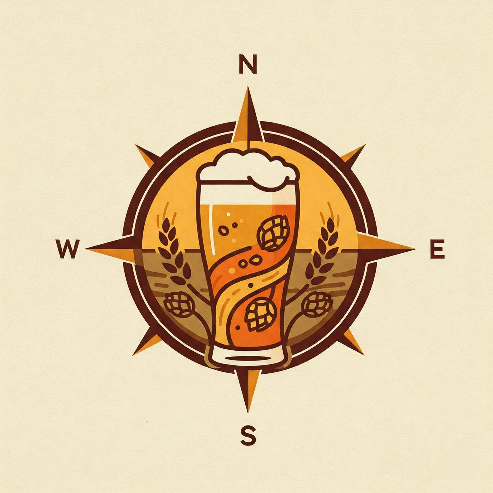
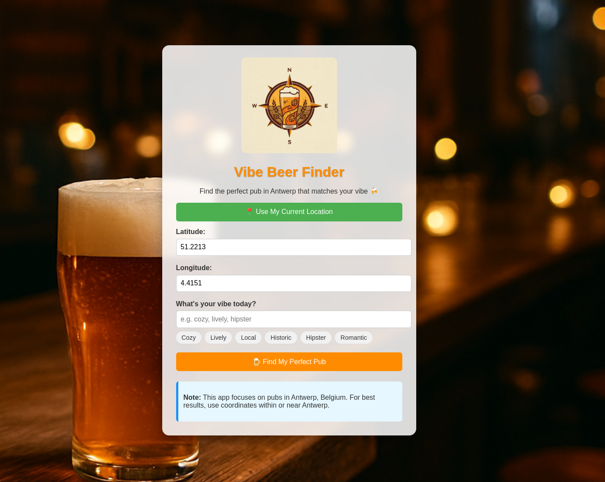
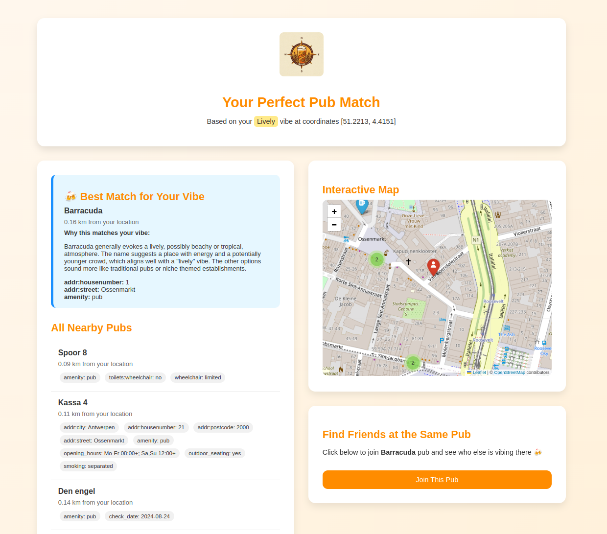

# 🍺 Vibe Beer Finder

A Flask web application that helps users find pubs in Antwerp, Belgium that match their desired vibe using geolocation and AI-powered vibe matching.



## 📋 Overview

Vibe Beer Finder combines geolocation data with generative AI to help users discover pubs in Antwerp that match their specific mood or "vibe". Whether you're looking for something cozy, lively, historic, or hipster, the application will find the perfect pub for your current mood.

## ✨ Features

- Find pubs nearest to your current location in Antwerp
- Match pubs to your desired vibe using Google's Gemini AI
- Interactive map visualization with pub markers
- Detailed pub information including distance, name, and attributes
- Mobile-friendly responsive design

## 🛠️ Tech Stack

- **Backend**: Python, Flask
- **Frontend**: HTML, CSS, JavaScript
- **Data**: OSM (OpenStreetMap) data via Hugging Face datasets
- **AI**: Google's Gemini 2.0 Flash for vibe matching
- **Mapping**: Folium (based on Leaflet.js)
- **Distance Calculation**: Haversine formula

## 📷 Screenshots




## 🚀 Installation

1. Clone the repository:
   ```bash
   git clone https://github.com/yourusername/vibe-beer-finder.git
   cd vibe-beer-finder
   ```

2. Create and activate a virtual environment:
   ```bash
   python -m venv venv
   source venv/bin/activate  # On Windows: venv\Scripts\activate
   ```

3. Install the required packages:
   ```bash
   pip install -r requirements.txt
   ```

4. Create a `.env` file in the project root with your Google API key:
   ```
   GOOGLE_API_KEY=your_google_api_key_here
   ```

## 📝 Requirements

Create a `requirements.txt` file with the following dependencies:

```
flask==2.3.3
folium==0.14.0
datasets==2.14.5
pandas==2.1.1
python-dotenv==1.0.0
google-generativeai==0.3.1
```

## 🗂️ Project Structure

```
vibe-beer-finder/
├── static/
│   ├── logo_beer_finder.jpeg
│   ├── beer_background.png
│   └── pub_map.html (generated)
├── templates/
│   ├── index.html
│   ├── results.html
│   └── error.html
├── vibe_beer_finder.py
├── .env
└── requirements.txt
```

## 🎮 Usage

1. Start the Flask application:
   ```bash
   python vibe_beer_finder.py
   ```

2. Open your web browser and navigate to `http://127.0.0.1:5000/`

3. Use the application by:
   - Clicking "Use My Current Location" or entering coordinates manually
   - Entering your desired vibe or selecting from the suggested options
   - Clicking "Find My Perfect Pub" to see results

## 💡 How It Works

1. **Data Source**: The application uses OpenStreetMap data for Antwerp, filtered to include only venues tagged as "pub".

2. **Location Processing**: When a user shares their location, the app uses the Haversine formula to calculate the distance to nearby pubs.

3. **Vibe Matching**: The user's desired vibe is sent to Google's Gemini AI, which selects the most suitable pub from the nearest options.

4. **Visualization**: Results are displayed on an interactive map with color-coded markers for the user's location and the selected pub.

## 🔍 API Endpoints

- `GET /`: Main page with the search form
- `POST /`: Submit search form to find matching pubs
- `POST /api/pubs`: JSON API for programmatic access to pub data

## 🏠 Example Vibes

- Cozy
- Lively
- Local
- Historic
- Hipster
- Romantic

## 📋 Future Enhancements

- User accounts and saved favorite pubs
- User ratings and reviews
- Expanded coverage to other cities
- More detailed filters (price range, beer selection, etc.)
- Real-time occupancy data
- Social features for connecting with friends

## 🧩 Code Highlights

### Vibe Matching with Google's Gemini AI

```python
def generate_vibe_match(vibe, pub_list):
    """
    Use Google's Gemini model to find the pub that best matches the desired vibe
    """
    if not api_key:
        # If no API key, just return the first pub with a placeholder message
        pub_list[0]["explanation"] = "API key not set. Unable to match vibe."
        return pub_list[0]
    
    pub_names = [pub["name"] for pub in pub_list[:5]]
    
    prompt = f"""Given the vibe: '{vibe}'. With these 5 pubs located in Antwerp: {pub_names} that are closest to me.
    
    1. Which ONE pub best matches the '{vibe}' vibe? Just give me the name.
    2. Also provide a brief explanation for why this pub matches the vibe.
    
    Format your response as:
    PUB NAME: [name of the selected pub]
    EXPLANATION: [your explanation]
    """
    
    try:
        response = model.generate_content(prompt)
        response_text = response.text
        
        # Parse the response to extract the pub name and explanation
        lines = response_text.strip().split("\n")
        selected_pub_name = None
        explanation = ""
        
        for line in lines:
            if line.startswith("PUB NAME:"):
                selected_pub_name = line.replace("PUB NAME:", "").strip()
            elif line.startswith("EXPLANATION:"):
                explanation = line.replace("EXPLANATION:", "").strip()
            # Collect additional explanation lines
            elif selected_pub_name and not line.startswith("PUB NAME:"):
                explanation += " " + line.strip()
                
        # Find the matching pub from our list
        for pub in pub_list:
            if selected_pub_name and selected_pub_name in pub["name"]:
                pub["explanation"] = explanation
                return pub
        
        # If we couldn't find a match, return the first pub with the explanation
        pub_list[0]["explanation"] = explanation if explanation else "No explanation provided by AI"
        pub_list[0]["note"] = f"AI suggested '{selected_pub_name}' but it couldn't be matched to our data"
        return pub_list[0]
        
    except Exception as e:
        # In case of any error, return the first pub with error info
        pub_list[0]["explanation"] = f"Error matching vibe: {str(e)}"
        return pub_list[0]
```

### Distance Calculation

```python
def haversine(lon1, lat1, lon2, lat2):
    """
    Calculate the great circle distance between two points 
    on the earth (specified in decimal degrees)
    """
    # Convert decimal degrees to radians
    lon1, lat1, lon2, lat2 = map(radians, [lon1, lat1, lon2, lat2])
    
    # Haversine formula
    dlon = lon2 - lon1 
    dlat = lat2 - lat1 
    a = sin(dlat/2)**2 + cos(lat1) * cos(lat2) * sin(dlon/2)**2
    c = 2 * asin(sqrt(a)) 
    r = 6371  # Radius of earth in kilometers
    return c * r
```

## 📄 License

This project is licensed under the MIT License.

## 🙏 Acknowledgements

- [OpenStreetMap](https://www.openstreetmap.org/) for the map data
- [Google Generative AI](https://ai.google.dev/) for the Gemini model
- [Folium](https://python-visualization.github.io/folium/) for the interactive maps
- [Flask](https://flask.palletsprojects.com/) for the web framework
- [Hugging Face Datasets](https://huggingface.co/docs/datasets/index) for the Antwerp OSM data
